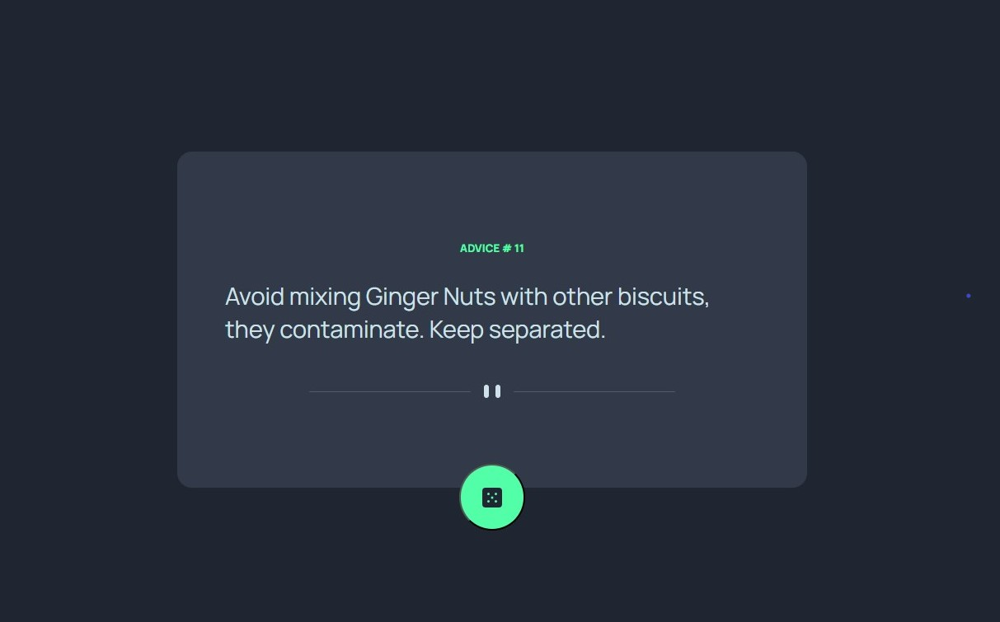

# Frontend Mentor - Advice generator app solution

This is a solution to the [Advice generator app challenge on Frontend Mentor](https://www.frontendmentor.io/challenges/advice-generator-app-QdUG-13db). Frontend Mentor challenges help you improve your coding skills by building realistic projects.

## Table of contents

- [Frontend Mentor - Advice generator app solution](#frontend-mentor---advice-generator-app-solution)
  - [Table of contents](#table-of-contents)
  - [Overview](#overview)
    - [The challenge](#the-challenge)
    - [Screenshot](#screenshot)
    - [Links](#links)
    - [Built with](#built-with)
    - [What I learned](#what-i-learned)
  - [Author](#author)

## Overview

### The challenge

Users should be able to:

- View the optimal layout for the app depending on their device's screen size
- See hover states for all interactive elements on the page
- Generate a new piece of advice by clicking the dice icon

### Screenshot

### Links

- Solution URL: https://github.com/cameaann/advice-generator
- Live Site URL: https://cameaann.github.io/advice-generator/

### Built with

- Semantic HTML5 markup
- CSS custom properties
- Flexbox
- [React](https://reactjs.org/) - JS library
- [Zod] a TypeScript-first schema declaration and validation library (https://www.npmjs.com/package/zod#parse)

### What I learned

I started learning Typscript.
It was useful for me to revise how to fetch data from rest api but it was quite difficult to understand how to make the custom hook to work in the other component.

## Author

- Frontend Mentor - [@cameaann](https://www.frontendmentor.io/profile/cameaann)
